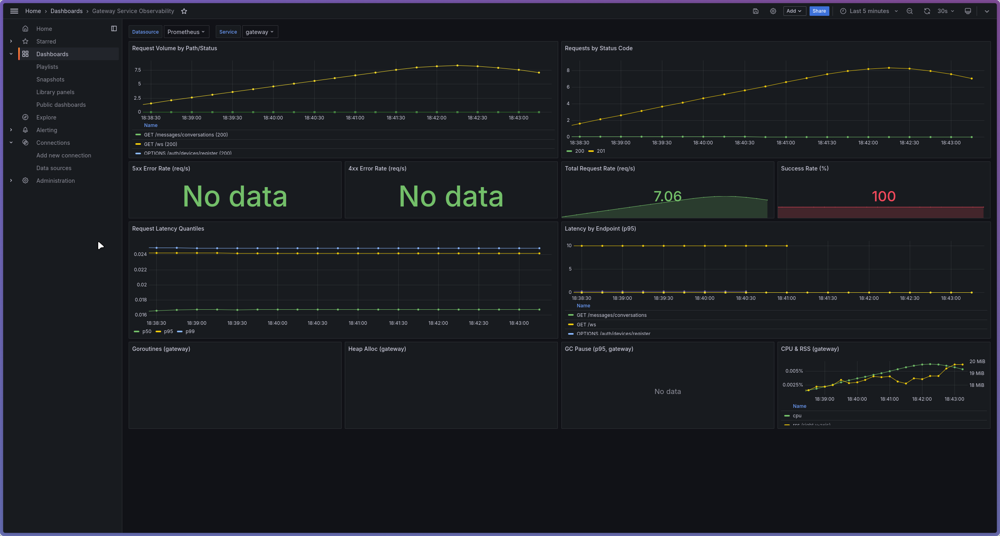
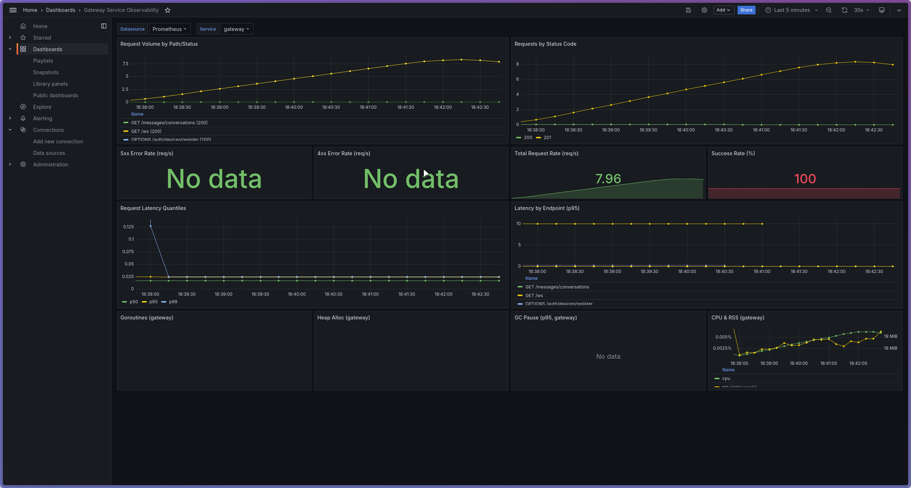

# Load & Performance Test Report – E2EE Messaging Platform

## 1. Introduction

This report describes the load and performance testing of the E2EE messaging platform developed as part of my Semester 7 individual project. The goal of the tests is to evaluate how the system behaves under realistic and extreme load, identify performance bottlenecks, and document improvements.

The system under test consists of multiple Go microservices (auth, keys, messages, gateway) deployed on Kubernetes (minikube), with PostgreSQL as the primary data store.

---

## 2. Objectives & Success Criteria

### 2.1 Objectives

- Validate that core user flows (login, sending 1:1 messages, sending group messages) perform acceptably under expected load.
- Determine the maximum sustainable load before the system degrades (increased latency, errors).
- Collect evidence for performance-related learning outcomes (e.g. scalable architectures, CI/CD and quality).

### 2.2 Success Criteria / SLAs

Define clear, measurable targets, for example:

- **Availability:** Error rate (5xx responses) < 1% for expected load.
- **Latency:** p95 response time < 300 ms for `/messages/send` under expected load.
- **Throughput:** At least **5** messages per second under expected load (baseline target).
- **Stability:** No crashes or restarts during a **5-minute** soak test at baseline load.

---

## 3. Test Environment

### 3.1 Infrastructure

- **Cluster:** minikube on local machine  
- **Kubernetes version:** `v1.34.2`
- **Node resources:** `2` CPU cores, `8` GB RAM
- **Database:** PostgreSQL `16`, single instance

### 3.2 Application Version

- Git branch: `main` (local run)  
- Commit: not recorded for this run (local working tree)  
- Runtime: local dev stack (gateway/auth/keys/messages) via Compose/minikube; gateway exposed on `http://localhost:8080`.

### 3.3 Monitoring & Observability

- **Metrics:** Prometheus 
- **Dashboards:** Grafana (if used)
- **Logs:** Loki / kubectl logs

### Gateway Dashboard:

### Messages Dashboard

---

## 4. Test Scenarios & Workload Model

### 4.1 Scenario A – Send 1:1 Message

- **Endpoint:** `POST /messages/send` (via gateway on `http://localhost:8080`)
- **Description:** Simulates a user sending an encrypted 1:1 message. Payload includes `conv_id`, `from_device_id`, `to_device_id`, `ciphertext` (base64), and opaque `header` JSON.
- **Tooling:** k6 (`infra/k6/baseline-send-message.js`).
- **Workload:** 3-stage ramp (1m to 10 VUs, hold 3m at 10, ramp down 1m).
- **Auth:** Bearer access token supplied via env; fixed conversation/device IDs.
- **Results (5m run):**
  - Requests: **2403** total (avg **~8 req/s**)
  - Success: **100%** (0 failures)
  - Latency: avg **12.6 ms**, median **13.1 ms**, p90 **13.8 ms**, p95 **14.2 ms**, max **17.6 ms**
  - HTTP failures: **0%**
  - Data sent/received: ~1.9 MB sent, ~0.9 MB received
  - Iteration duration: ~1.01 s (includes 1 s sleep per iteration)
  - VUs: peaked at **10** as configured

The measured latency and error rate meet the baseline SLAs (p95 < 300 ms; error rate < 1%; throughput > 5 req/s).
